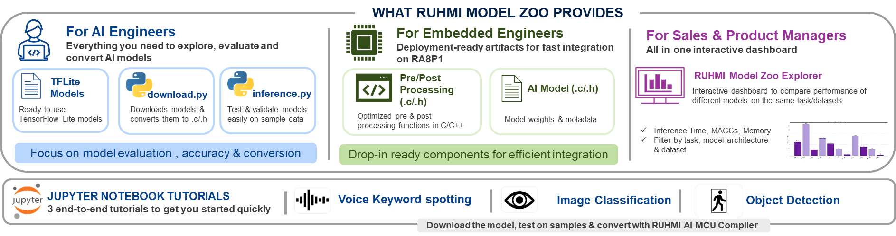

# RUHMI Model Zoo

RUHMI Model zoo is a collection of models, notebooks, and model artifacts curated for Renesas Embedded platforms. It demonstrates how to evaluate, quantize, compile and run neural network models for on-device inference using the RUHMI Framework stack.

The repo is organized to separate compilation helpers and compiler-specific environment, and model-specific inference code and notebooks. It is intended as a benchmark showcase of models and workflows for embedded/edge deployment of these models on the RA8P1.



## Highlights

- Target board: Renesas RA8P1 (Cortex-M85 + Ethos-U55 NPU)
- Compilation/quantization workflow uses RUHMI Framework (Renesas BYOM framework), which includes AI MCU Compiler with the MERA 2.0 backend (EdgeCortix integration)
- Python 3.10 is the preferred runtime for all venvs (Windows and Ubuntu)
- Per-model `requirements.txt` files are provided for inference dependencies (so you can create a model-specific venv)

## Compiler Stack Terminology

- RUHMI Framework: Renesas BYOM framework and umbrella stack used to bring customer models into the deployment flow.
- AI MCU Compiler: Compiler component within RUHMI Framework used to quantize and generate deployable artifacts for RA8P1.
- MERA 2.0 backend: Backend within RUHMI Framework used in this model zoo activity (EdgeCortix integration).


## Repository layout

Top-level structure (important folders):

- `ruhmi_tools/` — Generic compilation and RUHMI integration code. It contains compilation flows and shared code.
- `tutorials/` — Notebooks that show end-to-end examples per task. E.g. `Image Classification, Object Detection etc`
- `vision/` — Vision model collections organized by task (image classification, object detection, face detection).
- `audio/` — Audio model collections organized by task (audio classification / keyword spotting).
- `real_time_analytics/` — Real-time analytic model collections organized by task (e.g. anomaly detection).

## Available Models

| Task | Models | README |
|------|:------:|--------|
| Image Classification | 7 | [View models](vision/image_classification/README.md) |
| Object Detection | 2 | [View models](vision/object_detection/README.md) |
| Face Detection | 1 | [View models](vision/face_detection/README.md) |
| Audio Classification | 1 | [View models](audio/audio_classification/README.md) |
| Anomaly Detection | 1 | [View models](real_time_analytics/anomaly_detection/README.md) |

> Each task README contains a detailed table of all models with dataset, input shape, accuracy, and per-model links.

## Design and usage notes

- Notebooks: The notebooks in `tutorials/` are runnable examples. They contain guidance for preprocessing and inference. If you'd like to run a different model in a notebook, copy the preprocess/postprocess code from that model's `inference.py` into the notebook.
- Per-model venvs: Since different inference examples may require different Python packages (and because RUHMI/MERA compiler dependencies can conflict with inference packages), we recommend creating a separate venv for:
	1. Compilation (RUHMI / MERA) — a single shared compiler venv that you use to compile/quantize models for RA8P1.
	2. Inference per model — create a venv per model or per notebook using the model's `requirements.txt`.

## Quick start

1. Clone the repo

    ```bash
    git clone https://github.com/Renesas-AI-MCU-Enablement/Model-zoo.git
    cd Model-zoo
    ```

    Before creating venvs, ensure Python 3.10 is installed on your system.

2. Compiler installation (one-time) — create and configure the compiler venv

    The RUHMI/MERA compilation toolchain requires a contained environment that may include low-level or platform-specific wheel files. Create a dedicated compiler venv (eg: `.mera_venv`) and use it only when compiling or quantizing models.

    Download RUHMI AI MCU compiler from its respective [GitHub](https://github.com/renesas/ruhmi-framework-mcu/tree/main) and follow the installation instructions [here](https://github.com/renesas/ruhmi-framework-mcu/tree/main/install).


### Virtual Environment Best Practices

1. Keep `.mera_venv` dedicated to compilation tasks. Avoid installing model runtime packages here.

2. Inference venv (per model) — runtime and notebook environments

    Create a small, model-specific venv for running inference, notebooks, and examples. This keeps runtime dependencies (numpy, pillow, torch, etc.) isolated and easy to reproduce.

    Why this split is helpful

    - Compiler venv (`.mera_venv`) isolates heavy, possibly native or low-level dependencies required for conversion.
    - Inference venvs are lightweight and per-model, so running experiments and notebooks is safer and faster.


3. Run a tutorial notebook

    Activate a model venv, install `notebook` or `jupyterlab` if needed, then open the notebook in `tutorials/` and follow the instructions.

    ```bash
    pip install notebook
    pip install jupyter ipykernel
    pip install --user --upgrade ipywidgets
    jupyter notebook tutorials/image_classification.ipynb
    ```
